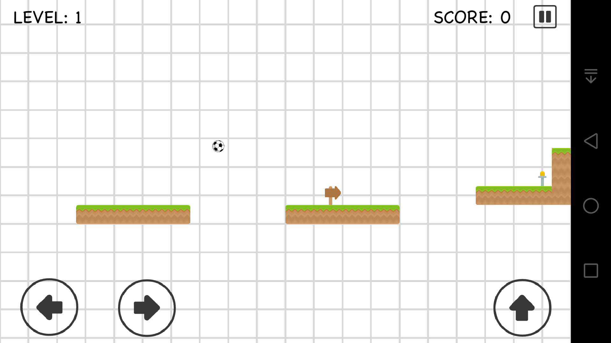
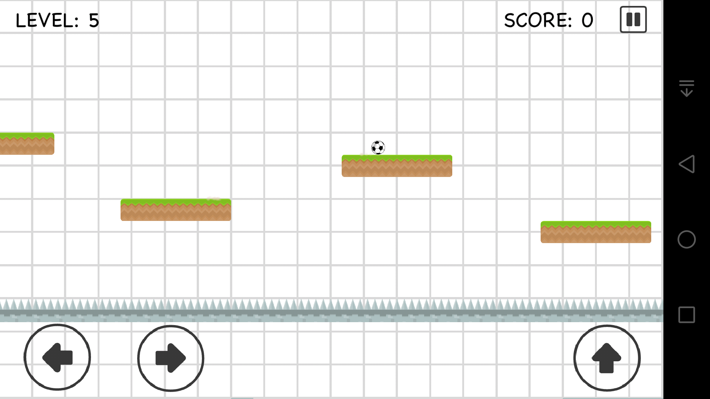
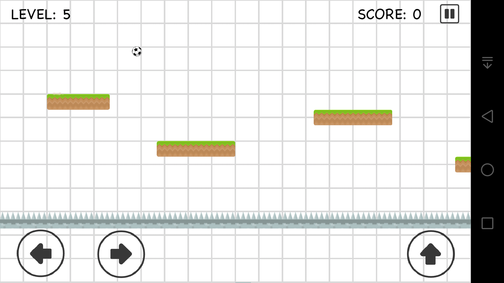

# Ball Platformer 2D
Ball Platformer 2D is a cross-platform game written in Java using the LibGDX framework.

# Gameplay preview
Level selection screen
 
<table><tr><td>

</td>
<td>

</td></tr></table>
 

<table><tr><td>

</td>
<td>

</td></tr></table>
 
<table><tr><td>

</td>
<td>

</td></tr></table>
 
<table><tr><td>

</td>
<td>

</td></tr></table>
 
<table><tr><td>

</td>
<td>

</td></tr></table>
 
<table><tr><td>

</td></tr></table>
 
